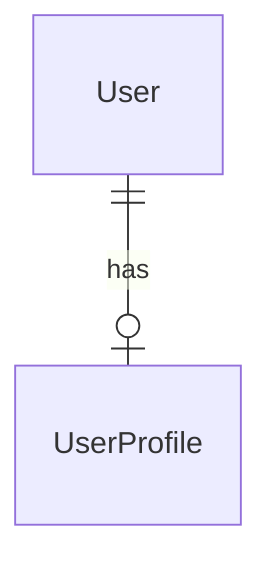

# データベース設計

## 概要

ORM: Prisma 6.x / DB: PostgreSQL

---

## ER図（全体概要）

---

## テーブル一覧

<!-- テーブル一覧を記載。詳細は docs/設計書/テーブル定義書.md を参照 -->

| # | テーブル名 | 説明 | 実装Phase |
|---|-----------|------|----------|

---

## Enum定義

<!-- Enum の一覧を記載 -->

---

## 改訂履歴

| 版数 | 日付 | 内容 | 担当 |
|------|------|------|------|
| 1.0 | yyyy-mm-dd | 初版作成 | |
