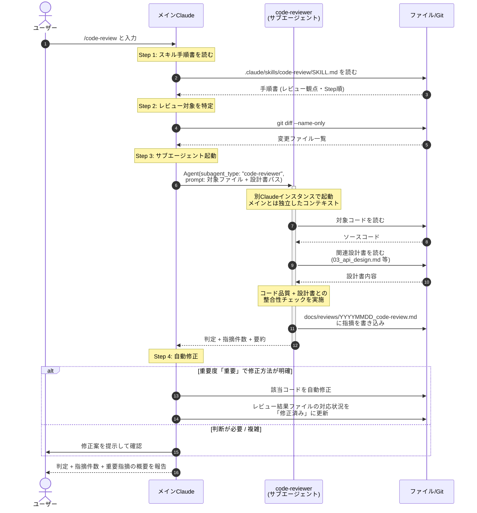

# /code-review スキル実行時の内部動作

`/code-review` というスラッシュコマンドを入力してから結果が返ってくるまで、裏側で何が起きているかを示すシーケンス図。

**ポイント**:
- メインClaude が SKILL.md の手順書を読み、`Agent()` で **code-reviewer サブエージェントを別コンテキストで起動**する
- サブエージェントはメインとは独立したコンテキストでコード + 設計書を読み、`docs/reviews/` にレビュー結果を書き込む
- 「重要」な指摘は自動修正、複雑なものはユーザーに確認を求める

この図は `/code-review` を例にしているが、他のスキル（`/design-review`, `/browser-test` 等）もほぼ同じパターンで動作する。

## 図の構成

### アクター（4者）

| アクター | 役割 |
|---------|------|
| **ユーザー** | `/code-review` を入力して実行を依頼する人 |
| **メインClaude** | ユーザーと会話している Claude Code。スキル手順書を読んで処理を進める |
| **code-reviewer（サブエージェント）** | 活性化バーで起動期間を表示。メインとは独立したコンテキストで動く |
| **ファイル/Git** | ソースコード、設計書、レビュー結果ファイル、git コマンド |

### 時系列の流れ（4ステップ）

| Step | 内容 |
|------|------|
| **Step 1: スキル手順書を読む** | `/code-review` 入力後、メインClaude が `SKILL.md` を読み込む |
| **Step 2: レビュー対象を特定** | `git diff --name-only` で変更ファイルを把握 |
| **Step 3: サブエージェント起動** | `Agent(subagent_type: "code-reviewer", ...)` でサブエージェントを別コンテキストで起動。サブは対象コード + 設計書を読み、`docs/reviews/` に指摘を書き込む |
| **Step 4: 自動修正** | 重要度「重要」で明確な修正方法があれば自動修正、判断が必要な場合はユーザーに確認 |

## 読み方

| ステップ | 内容 |
|---------|------|
| ①〜② | `/code-review` を受け取って、メインClaude がスキル手順書を読み込む |
| ③〜④ | git で変更ファイルを取得（レビュー対象の特定） |
| ⑤ | `Agent()` でサブエージェントを起動。これ以降 ⑩ まではサブが別コンテキストで動く |
| ⑥〜⑩ | サブエージェントがコード・設計書を読み、レビュー結果を `docs/reviews/` に保存してメインに結果サマリーを返す |
| ⑪〜 | メインClaude が重要度「重要」の指摘を自動修正、あるいはユーザーに確認 |
| 最後 | 判定・指摘件数・要約をユーザーに報告 |

## 他のスキルも同じパターン

- `/design-review` → `code-reviewer` エージェント（設計レビューモード）
- `/browser-test` → `browser-tester` エージェント
- `/update-docs` → `documentation-manager` エージェント

いずれも「メインClaude がスキル手順書を読み → 必要に応じてサブエージェントを起動 → 結果をファイル保存 → ユーザーに要約を返す」という共通構造になっている。
