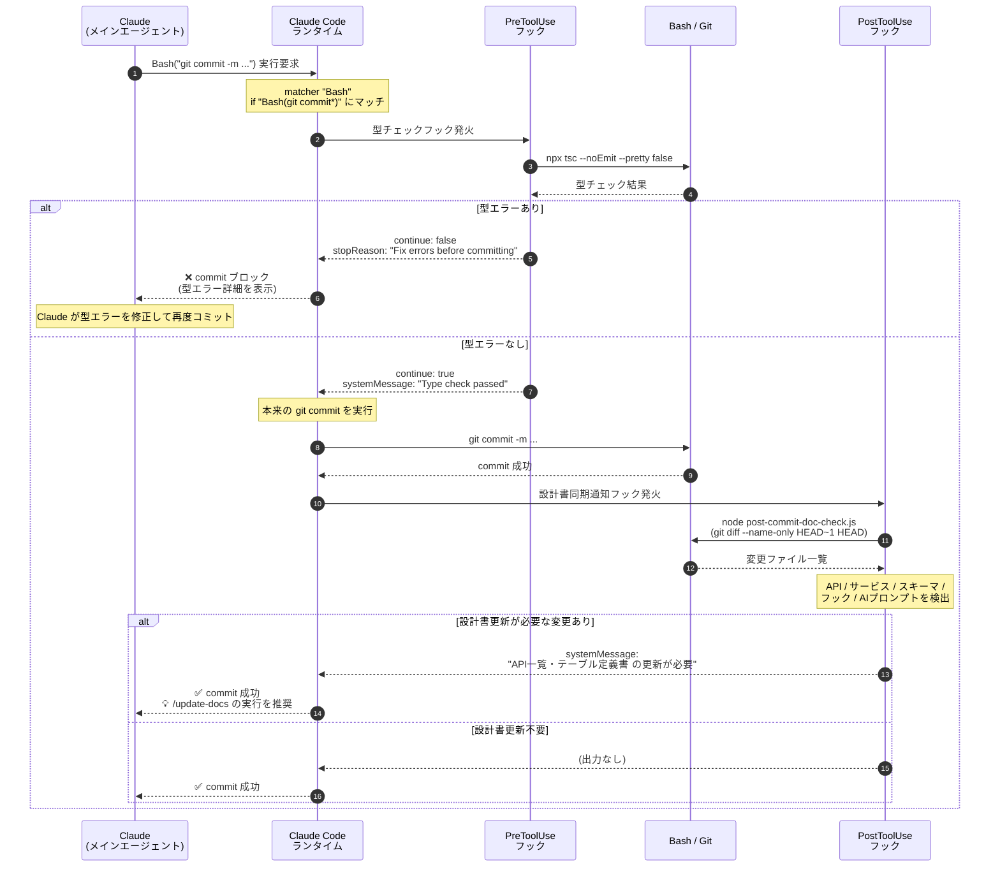

# コミット前後のフック発火タイミング図

`git commit` コマンドを実行した際、裏側で自動的に動く **PreToolUse フック（型チェック）** と **PostToolUse フック（設計書同期通知）** の発火タイミングを示すシーケンス図。

**ポイント**:
- フックは Claude の判断とは無関係に、**Claude Code ランタイムが自動発火**する
- 型エラー時は commit が**物理的にブロックされる**（Claude が強行できない）
- commit 成功後は変更内容を解析して、設計書更新が必要なら Claude に通知する

## 図の構成

### アクター（5者）

| アクター | 役割 |
|---------|------|
| **Claude（メインエージェント）** | `git commit` を実行しようとする主体 |
| **Claude Code ランタイム** | ハーネスの実体。フックの発火制御を担当 |
| **PreToolUse フック** | ツール実行**前**に発火。成功/失敗で本体実行を制御できる（ブロック可能） |
| **Bash / Git** | 実際のコマンド実行（tsc、git commit、ファイル操作） |
| **PostToolUse フック** | ツール実行**後**に発火。実行後のチェック・通知に使う |

### 時系列の流れ

| Phase | 内容 |
|-------|------|
| **1. commit 要求** | Claude が `Bash("git commit -m ...")` を実行しようとする |
| **2. PreToolUse 発火** | `if "Bash(git commit*)"` にマッチ → 型チェックフックが起動 → `npx tsc --noEmit` を実行 |
| **3a. 型エラー時** | `continue: false` + `stopReason` でランタイムに返される → commit は実行されず Claude にブロック通知 |
| **3b. 型チェック成功時** | 本来の `git commit` を実行 → commit 成功 |
| **4. PostToolUse 発火** | `post-commit-doc-check.js` が起動 → 変更ファイルを解析 |
| **5. 設計書同期判定** | API/サービス/スキーマ等の変更があれば `systemMessage` で Claude に通知 |

## 図

## 読み方

| ステップ | 意味 |
|---------|------|
| ①〜④ | Claude の commit 要求 → ランタイムが matcher を評価 → PreToolUse フック起動 → tsc 実行 |
| ⑤ | 型チェック結果が Pre フックに返る |
| ⑥〜⑦ (エラー時) | `continue: false` で commit ブロック。Claude に型エラーを伝えて修正を促す |
| ⑥〜⑪ (成功時) | commit 本体実行 → PostToolUse フック発火 → 変更ファイル解析 |
| ⑫〜⑬ (通知あり) | 設計書更新が必要なら Claude に `/update-docs` の実行を促す |
| ⑫〜⑬ (通知なし) | 何も通知せず、通常の commit 完了として Claude に返る |

## 他のフックも同じパターン

本テンプレートには `git commit` のフック以外に、**DBバックアップフック** も設定されている:

| フック | 種類 | 発火条件 | 動作 |
|-------|------|---------|------|
| DBバックアップフック | PreToolUse | `Bash(npx prisma migrate:*)` | `export-to-sql.ts` を実行。失敗なら migrate をブロック |
| 型チェックフック | PreToolUse | `Bash(git commit*)` | `tsc --noEmit` を実行。型エラーなら commit をブロック |
| 設計書同期通知フック | PostToolUse | `Bash(git commit*)` | 変更内容を解析し、設計書更新の必要性を通知 |

いずれも「**ランタイムがツール実行を検知 → `if` 条件で絞り込み → コマンド実行 → 結果を JSON でランタイムに返す**」という共通構造になっている。

## フックの設計思想

- **ブロックすべきもの** → PreToolUse でエラー時に `continue: false`（型チェック、DBバックアップ）
- **通知だけで済むもの** → PostToolUse で `systemMessage`（設計書同期）
- **忘れると致命的なチェック** をフックで強制することで、Claude の判断ミスや手順忘れを防ぐ

詳細は `.claude/settings.json` を参照。
