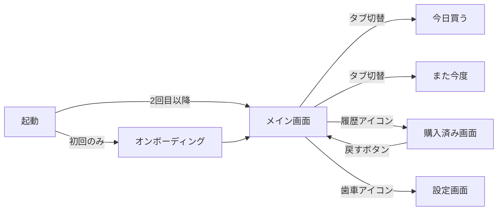

# 買い物リストアプリ 企画書

## 1. プロダクト概要

| 項目 | 内容 |
|---|---|
| プロダクト名（仮） | shopping-list-app |
| 一言で言うと | シンプルに使える買い物リストアプリ |
| ターゲット | 日常の買い物でメモを取る習慣がある人（自炊派、家族の買い物担当、まとめ買い派） |
| 対応端末 | **スマホ専用**（375px 基準）。PC/タブレット幅のレイアウト最適化は対応しない |
| データ保存（MVP） | **ブラウザの LocalStorage に保存**（端末ローカルのみ）。サーバー保存・端末間同期は将来対応 |

## 2. コンセプト

> **「思いついた瞬間に追加でき、買い物中は一目で残りが分かる」**

- 既存の買い物アプリは多機能ゆえに「追加が遅い」「画面が混雑している」という課題がある
- 本アプリは **追加と購入チェックの2アクションを最速にする** ことを最優先する
- MVP は **ログインなし・端末ローカル保存** で「開いて即使える」状態を目指す
- 機能は欲張らず、MVP は「今買うべきものを一覧で見せる」一点に絞る

## 3. 解決したい課題（ユーザーの声）

| シーン | 課題 | 本アプリの解決アプローチ |
|---|---|---|
| 思いついた瞬間 | メモアプリだと購入チェックの管理ができない | ワンタップで追加、ワンタップで購入済み化 |
| 買い物中 | 何が残っているか紙メモではゴチャつく | 購入済みは即時に消えて、残るものだけ表示 |
| 今日と次回の区別 | 「これは今日でなくてもいい」を分けたい | 「今日買う」「また今度」の2区分 |
| 何度も買う物 | 毎回同じものを入力するのが面倒 | （将来）リストセット機能 |
| 圏外（店舗内） | 電波が弱いとアプリが動かないことがある | LocalStorage 採用により自然にオフライン動作 |

## 4. 機能要件

### 4.1 MVP（最初のリリース）

| # | 機能 | 概要 |
|---|---|---|
| F-01 | アイテム追加（単発） | テキスト入力 → エンター/追加ボタンで即追加 |
| F-02 | アイテム追加（一括） | 改行区切りで複数追加（区切り仕様は §10.1 参照） |
| F-03 | 購入済みに変更 | チェックボックスをタップで購入済みへ移動、未購入リストから即時消える |
| F-04 | 未購入に戻す | 購入済みアイテムをタップで未購入に戻す |
| F-05 | 「今日買う」/「また今度」の区分 | 各アイテムにフラグを持ち、タブで切り替え表示 |
| F-06 | 区分の移動 | 「また今度」→「今日買う」に簡単に移動（タップ or スワイプ） |
| F-07 | ソート | 名前順 / 登録日時順 / **手動順** を切り替え |
| F-08 | アイテム削除 | 不要になったアイテムを削除（購入済みでなくても削除可） |
| F-09 | 端末ローカル保存 | LocalStorage に永続化（Zustand persist ミドルウェア） |
| F-10 | 初回オンボーディング | 「データはこの端末のみに保存されます」を初回起動時に明示 |
| F-11 | ドラッグでの並び替え | 長押しドラッグで未購入リストの並び替え。ドラッグした瞬間に自動で「手動順」ソートに切り替わる |

### 4.2 将来機能（MVP 後）

| # | 機能 | 概要 | 優先度 |
|---|---|---|---|
| F-20 | アカウント登録・ログイン | Google OAuth でサインイン | 高 |
| F-21 | クラウド同期 | サーバーDBにデータ保存し、複数端末で同期 | 高 |
| F-22 | リストセット登録 | 「カレーセット」「調味料セット」などをセット定義 | 高 |
| F-23 | セットからまとめて追加 | セットを選んでワンタップで全アイテムをリスト追加 | 高 |
| F-24 | 自動分類 | 購入品を「野菜」「肉」「日用品」などに自動分類 | 中 |
| F-25 | 店舗別リスト | 「スーパー」「薬局」「100均」などリストを複数持てる | 中 |
| F-26 | 数量・単位 | 「玉ねぎ 2個」のような数量管理 | 低（要検討、§10.5） |

## 5. 画面構成

スマホ専用のため、画面は**縦スクロール前提**、ナビゲーションは**画面下部**を基本とする。
MVP ではログイン画面が不要になるため、起動直後がメイン画面になる（初回のみオンボーディング）。



| 画面 | パス | 役割 |
|---|---|---|
| メイン | `/` | 「今日買う」「また今度」タブで未購入リスト表示。下部に追加入力欄 |
| 購入済み | `/history` | 購入済みアイテムの履歴。ここから未購入に戻せる |
| 設定 | `/settings` | ソート設定、データエクスポート、（将来）ログイン・セット管理 |

オンボーディングはモーダル/シート形式でメイン画面に重ねて表示する想定（独立画面にはしない）。

## 6. 画面レイアウト（スマホ 375px 基準）

### 6.1 オンボーディング（初回のみ）

```
┌─────────────────────────────┐
│                             │
│           🛒                │
│                             │
│   shopping-list-app へ      │
│        ようこそ              │
│                             │
│  シンプルに使える            │
│  買い物リスト                │
│                             │
│  ⚠️ データはこの端末にのみ   │
│     保存されます。           │
│     端末を変更・データ削除   │
│     すると消えます。         │
│                             │
│  ┌───────────────────────┐  │
│  │       はじめる         │  │
│  └───────────────────────┘  │
│                             │
└─────────────────────────────┘
```

### 6.2 メイン画面（未購入リスト）

```
┌─────────────────────────────┐
│ 🛒 買い物リスト   ↕ 🕘 ⚙️  │ ← ヘッダー（並替/履歴/設定）
├─────────────────────────────┤
│  ┌─────────┬───────────┐    │
│  │ 今日(5) │ また今度(3)│    │ ← タブ
│  └─────────┴───────────┘    │
├─────────────────────────────┤
│                             │
│  ☐  牛乳                  │ │ ← タップで購入済み化
│  ☐  卵 6個                ⤴│ ← ⤴は「また今度に移す」
│  ☐  パン                  │ │
│  ☐  玉ねぎ                │ │
│  ☐  にんじん              │ │
│                             │
│  （スクロール領域）         │
│                             │
├─────────────────────────────┤
│ [＋ 追加したい商品名…    ]→│ ← 下部固定 入力欄
└─────────────────────────────┘
```

**操作仕様（案）:**
- アイテムタップ（チェック領域）: 購入済みへ移動（一覧から即時消える）
- 行右端のアイコン: 「今日 ⇔ また今度」の区分切替
- 入力欄: 単発追加はエンターで送信。一括追加は改行で複数行入力可能（§10.1 参照）
- ヘッダー「↕」: ソート切替（名前順 / 登録日時順）
- ヘッダー「🕘」: 購入済み画面へ
- ヘッダー「⚙️」: 設定画面へ

### 6.3 購入済み画面

```
┌─────────────────────────────┐
│ ← 購入済み                   │
├─────────────────────────────┤
│  今日（2026/05/04）         │
│  ✓ 醤油              ↩  🗑 │ ← ↩で未購入に戻す/🗑で削除
│  ✓ 味噌              ↩  🗑 │
│                             │
│  昨日                       │
│  ✓ 牛乳              ↩  🗑 │
│  ✓ パン              ↩  🗑 │
│                             │
│  （古いものはスクロール）   │
│                             │
└─────────────────────────────┘
```

### 6.4 設定画面

```
┌─────────────────────────────┐
│ ← 設定                       │
├─────────────────────────────┤
│  表示設定                   │
│  並び順        登録日時 ▼   │
│                             │
│  データ                     │
│  ┌───────────────────────┐  │
│  │ JSON でエクスポート    │  │
│  └───────────────────────┘  │
│  ┌───────────────────────┐  │
│  │ JSON からインポート    │  │
│  └───────────────────────┘  │
│  ┌───────────────────────┐  │
│  │ すべてのデータを削除   │  │
│  └───────────────────────┘  │
│                             │
│  ─────────────────────────  │
│  shopping-list-app v0.1     │
└─────────────────────────────┘
```

将来的には「アカウント連携」「セット管理」セクションをこの画面に追加する。

## 7. データモデル概要（MVP）

LocalStorage に Zustand persist 経由で保存する。**将来のクラウド同期を見越して**、ID は `cuid()` などのグローバル一意な値、`updatedAt` は必須とする（同期時の競合解決に使う）。

```typescript
type ItemScope = 'TODAY' | 'LATER';
type ItemStatus = 'PENDING' | 'PURCHASED';
type SortKey = 'NAME' | 'CREATED_AT' | 'MANUAL';

type ShoppingItem = {
  id: string;            // crypto.randomUUID()
  name: string;          // 商品名
  scope: ItemScope;      // 'TODAY' | 'LATER'
  status: ItemStatus;    // 'PENDING' | 'PURCHASED'
  order: number;         // 手動並び替えの順序（昇順、scope ごと独立）
  createdAt: string;     // ISO 8601、登録日時ソートに使用
  updatedAt: string;     // ISO 8601、将来の同期で競合解決に使用
  purchasedAt: string | null; // 購入時刻、履歴のグルーピング用
};

type AppState = {
  items: ShoppingItem[];
  sort: SortKey;
  hasOnboarded: boolean;
};
```

LocalStorage キー: `shopping-list-app:state`（バージョン互換のため `version` を含めた構造で保存する）。

## 8. 技術スタック

実装済みの基盤のうち、認証・DB は MVP では使用しない。

| 領域 | 技術 | MVP 使用 |
|---|---|---|
| フレームワーク | Next.js 16 (App Router) | ✅ |
| UI | React 19 + TypeScript (strict) + Tailwind CSS 4 | ✅ |
| 状態管理 | Zustand 5 + `persist` ミドルウェア | ✅ |
| 永続化 | LocalStorage（`persist` の storage） | ✅ |
| ID生成 | `crypto.randomUUID()`（標準API、追加依存なし） | ✅ |
| ドラッグ&ドロップ | `@dnd-kit/core` + `@dnd-kit/sortable`（タッチ対応・React 19 対応） | ✅（Phase 5 で導入） |
| ORM/DB | Prisma 6 + PostgreSQL | ⏸ 将来（クラウド同期時） |
| 認証 | NextAuth 4（Google OAuth） | ⏸ 将来（クラウド同期時） |

## 9. リリースまでのマイルストーン（案）

| フェーズ | 内容 | 規模判定 | 状態 |
|---|---|---|---|
| Phase 1 | 状態管理ストア（Zustand + persist）+ 型定義 | M | ✅ 完了 |
| Phase 1.5 | ストア拡張: `order` フィールド + `MANUAL` ソート + `reorderItems` Action | M | 🟡 着手 |
| Phase 2 | メイン画面（未購入リスト + 単発追加 + 購入チェック） | L（UX 含む） | 🔵 |
| Phase 3 | 一括追加（改行区切り） | M | 🔵 |
| Phase 4 | 区分（今日 / また今度） + 区分間移動 | M | 🔵 |
| Phase 5 | ソート（名前 / 登録日時 / 手動）+ ドラッグ並べ替え UI（dnd-kit 導入） | M | 🔵 |
| Phase 6 | 購入済み画面 + 履歴/復元/削除 | M | 🔵 |
| Phase 7 | 設定画面（並び順、エクスポート/インポート、全削除） | M | 🔵 |
| Phase 8 | 初回オンボーディング | S | 🔵 |
| Phase 9（将来） | アカウント登録 + クラウド同期 | L | ⏸ |
| Phase 10（将来） | セット機能、店舗別リスト、自動分類 | L | ⏸ |

---

## 10. 検討事項・論点（壁打ちポイント）

### 10.1 一括追加の区切り文字 ★決定済

商品名にスペースを含むケース（`アイス クリーム` `ラ王 醤油`）を考慮し、**改行区切り**を採用する。
入力欄はデフォルトで1行表示、改行されたら自動で複数行に広がる挙動を想定。

### 10.2 「今日買う」と「また今度」のデフォルト

→ **アクティブなタブに入る**。今「また今度」を見ている状態で追加したら、それは「また今度」の物のはず。

### 10.3 購入済みアイテムの自動削除

LocalStorage の容量上限（5MB 程度）が現実的な制約。MVP では永久保存（手動削除）とし、容量問題が顕在化したら対応する。

### 10.4 オフライン対応 ★解決済

LocalStorage 採用により自動的にオフラインで動作する。PWA 化（ホーム画面追加）は Phase 8 以降の検討事項。

### 10.5 数量・単位の扱い

→ MVP は `name` フィールドのみ（`玉ねぎ 2個` のように自由記述）。F-24（自動分類）導入時に分離を検討。

### 10.6 「即時に購入済みに移動」のアニメーション

要件「購入したら即時に購入済みに移動して、残りの買うものが一目でわかる」を満たすには、フェードアウト＋リストの詰め直しが視覚的に大事。

→ Tailwind トランジション + React の状態更新で十分実現可能。Phase 2 の技術設計で詳細化。

### 10.7 LocalStorage の容量上限・破損対策

- 容量上限（ブラウザにより異なるが概ね 5〜10MB）に達した場合のエラーハンドリング
- JSON パース失敗時のフォールバック（破損データの復元 or 初期化）
- バージョン違いのデータ構造に対するマイグレーション（`version` フィールドで判定）

→ Phase 1 の技術設計で詳細化。

### 10.8 ドラッグ並び替えの UX ★方針確定

- **ライブラリ**: `@dnd-kit/sortable`（モバイルタッチ対応・React 19 互換・アクセシビリティ良好）
- **モード切替**: ドラッグ操作した瞬間に自動でソートを `MANUAL` に切り替える（ユーザーがモードを意識しなくて良いように）
- **開始トリガー**: 長押し（dnd-kit の `PointerSensor` の `delay`/`activationConstraint` を使い、誤タップを防ぐ）
- **対象範囲**: 未購入リストのみ。同一スコープ（今日 / また今度）内で並べ替え可能。スコープを跨いだドラッグはしない
- **データモデル**: `ShoppingItem.order: number`（昇順）を保持。`reorderItems` アクションで再採番

---

## 改訂履歴

| 版数 | 日付 | コミット | 内容 | 担当 |
|------|------|---------|------|------|
| 0.1 | 2026-05-04 | - | 初版作成（壁打ち用ドラフト） | Claude Code |
| 0.2 | 2026-05-04 | - | MVP方針を「認証なし・LocalStorage管理」に変更。将来クラウド同期を見越したデータモデルに修正 | Claude Code |
| 0.3 | 2026-05-04 | - | F-11 ドラッグでの並び替えを MVP に追加。データモデルに `order` 追加、`SortKey` に `MANUAL` 追加、Phase 1.5 を新設し Phase 5 にドラッグ UI を統合 | Claude Code |
