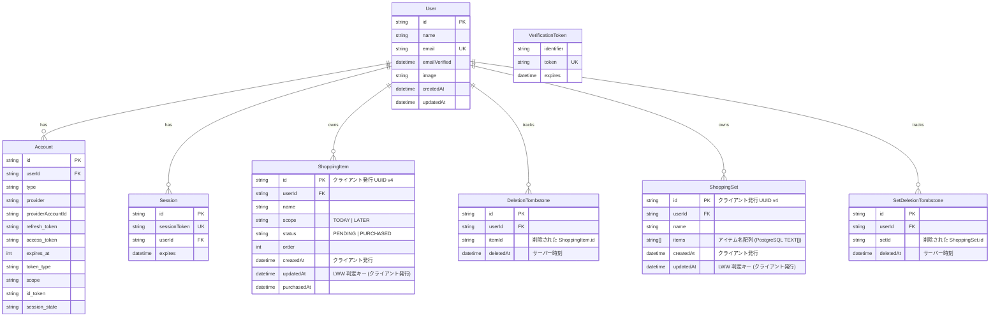

# ER図

Phase 9 (クラウド同期) で導入された 6 テーブル + Phase 10.1b (セット同期) で追加された 2 テーブル。Auth.js v5 標準モデル (User / Account / Session / VerificationToken) + アプリ固有モデル (ShoppingItem / DeletionTombstone / ShoppingSet / SetDeletionTombstone)。

## 主要な制約・インデックス

| テーブル | 制約 / インデックス | 用途 |
|---------|---------------------|------|
| `User` | `email` UNIQUE | 同一メールでの重複アカウント防止 |
| `Account` | `[provider, providerAccountId]` UNIQUE | 同一 OAuth アカウントの重複防止 |
| `Session` | `sessionToken` UNIQUE | セッション識別 |
| `VerificationToken` | `[identifier, token]` UNIQUE | トークン重複防止 |
| `ShoppingItem` | `[userId, updatedAt]` INDEX | GET の `since` 差分取得 |
| `ShoppingItem` | `[userId, scope, status]` INDEX | 一覧取得 |
| `DeletionTombstone` | `[userId, itemId]` UNIQUE | 削除 → 再作成 → 再削除での upsert 対応 |
| `DeletionTombstone` | `[userId, deletedAt]` INDEX | 差分削除トラッキング |
| `ShoppingSet` | `[userId, updatedAt]` INDEX | GET の `since` 差分取得 |
| `SetDeletionTombstone` | `[userId, setId]` UNIQUE | セット削除 → 再作成 → 再削除での upsert 対応 |
| `SetDeletionTombstone` | `[userId, deletedAt]` INDEX | セット差分削除トラッキング |

## Cascade 削除

すべてのアプリ固有テーブルは `User` に対して `onDelete: Cascade` で接続されている。アカウント削除時 (Phase 9.1 で実装予定) に関連データが自動削除される。

---

## 改訂履歴

| 版数 | 日付 | コミット | 内容 | 担当 |
|------|------|---------|------|------|
| 1.0 | 2026-05-04 | (未確定) | 初版作成。Phase 9 で導入された 6 テーブルの ER 図を mermaid で記載 | Claude Code |
| 1.1 | 2026-05-05 | (未確定) | Phase 10.1b でセット同期 2 テーブル (ShoppingSet / SetDeletionTombstone) と User からの relations を追加 | Claude Code |
